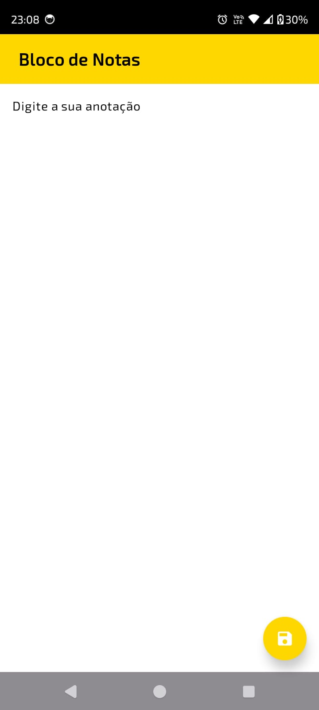
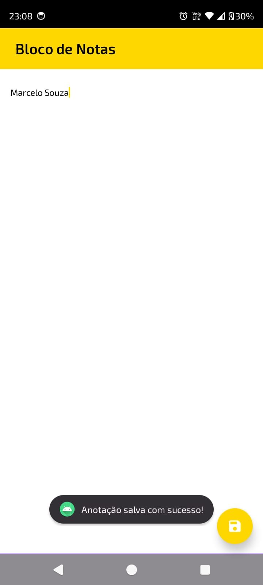

# Bloco de Notas - Jetpack Compose

Este projeto foi desenvolvido com o objetivo de melhorar meus conhecimentos em desenvolvimento Android utilizando o Jetpack Compose.
A aplicação é igual a um bloco de notas que permite aos usuários realizar anotações e salvar as mesmas de forma local no dispositivo
para poder checar quando quiser.

## ⚙️ Tecnologias utilizadas

- **Kotlin**: Linguagem principal de desenvolvimento.
- **Jdk 21**: Versão do java usado no desenvolvimento.
- **Jetpack Compose**: Framework para construção de UI nativa.
- **Koin Annotations**: Biblioteca de injeção de dependências.
- **DataStore**: Solução para armazenamento de dados.
- **JUnit**: Biblioteca de testes unitários.
- **Espresso**: Ferramentas de teste de UI para Compose.
- **MockK**: Biblioteca para criação de mocks em Kotlin.

## 📚 Estrutura do Projeto

- `presentation`: Contém as telas, temas e componentes de UI.
- `viewmodel`: Contém os ViewModels para gerenciamento de estado.
- `data`: Contém a lógica de acesso a dados, como o DataStore.
- `di`: Contém as definições de injeção de dependência usando Koin.

## 📝 Funcionalidades principais

- Adicionar, editar e excluir anotações.
- Interface moderna e responsiva com Jetpack Compose.
- Persistência de dados com DataStore.
- Injeção de dependências com Koin Annotations.
- Uso do Kotlin 2.0.0
- Uso do Java 21

## ☕ Usando Bloco de Notas

Para usar Bloco de Notas, siga estas etapas:

1. Abra o Android Studio.
2. Selecione "Open an existing project" e escolha a pasta do projeto clonado.
3. Execute o projeto em um emulador ou dispositivo físico.

## 📫 Contribuindo para Bloco de Notas

Para contribuir com Bloco de Notas, siga estas etapas:

1. Bifurque este repositório.
2. Crie um branch: `git checkout -b <nome_branch>`.
3. Faça suas alterações e confirme-as: `git commit -m '<mensagem_commit>'`
4. Envie para o branch original: `git push origin <nome_do_projeto>/<local>`
5. Crie a solicitação de pull.

## Imagens do App

Aqui estão algumas capturas de tela do aplicativo

    
    

### Contato

- **Nome**: Marcelo Souza
- **Email**: marcelocaregnatodesouza@gmail.com
- **LinkedIn**: [meu-linkedin](https://www.linkedin.com/in/marcelosouza-1999/)